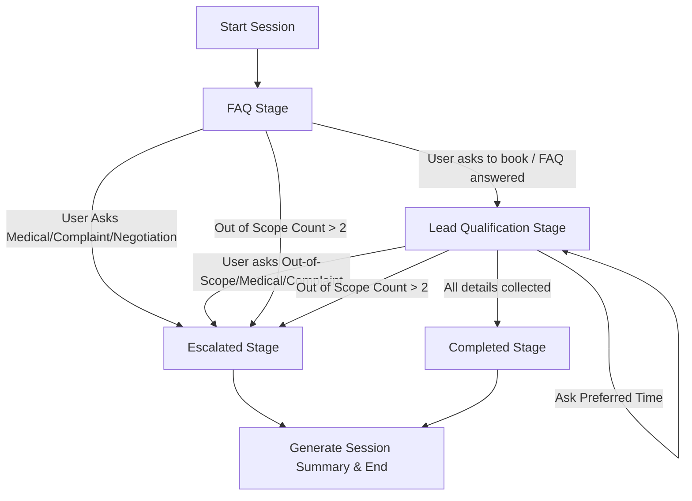

# Closira Customer Support Agent - Bloom Aesthetics Clinic (Gemini Edition)

An AI-powered customer support workflow simulation designed for **Closira** to represent **Bloom Aesthetics Clinic**, a premium medical aesthetics clinic. 

This project implements a Python-based stateful agent utilizing the **LangGraph StateGraph** pipeline and the **Google Gemini 1.5 Flash** (or **Gemini 1.5 Pro**) API. It securely manages conversational FAQ answering, customer qualification, safety escalation thresholds, and session audit logs.

---

## Features

1. **StateGraph Pipeline**: Powered by **LangGraph** to organize conversational phases into dedicated nodes (`FAQ`, `QUALIFICATION`, `escalate_node`, `summarize_node`) with formal conditional routers.
2. **Strict FAQ Grounding**: Answers queries strictly using the local `sop.json` database. Prevents hallucinating services, hours, or prices.
3. **Dynamic Lead Qualification**: Automates lead qualification for clinic bookings by asking three B2C questions:
   - Target Service (Botox, Fillers, or Consultation)
   - Client Status (New or Existing client)
   - Preferred Day and Time Range
4. **Multi-Category Escalation Engine**: Instantly flags human intervention triggers:
   - Customer complaints and negative sentiments.
   - Clinical/medical inquiries (side effects, safety, pregnancy).
   - Pricing negotiations and custom discount requests.
   - Programmatic thresholds (more than 2 out-of-scope or unanswered questions).
5. **Session Audit Summary**: At session termination (successful completion or escalation), an automated summary is compiled detailing customer intent, captured lead parameters, identified SOP gaps, and recommended actions.

---

## Project Structure

```text
x:\Coding\Project\project/
├── requirements.txt            # Python dependencies (google-generativeai, langgraph)
├── .env.example                # Configuration template
├── sop.json                    # Bloom Aesthetics Clinic SOP Database
├── workflow.py                 # Core AI agent & LangGraph StateGraph pipeline (Gemini Integration)
├── main.py                     # CLI Interactive Interface & Simulation runner
├── prompt_design.md            # Detailed prompt engineering reasoning for Gemini
└── test_transcripts/           # Generated verification transcripts
    ├── 1_in_sop_question.md
    ├── 2_out_of_scope.md
    ├── 3_escalation_trigger.md
    ├── 4_lead_qualification.md
    └── 5_conversation_summary.md
```

---

## Installation & Setup

1. **Clone or Open the Workspace**:
   Navigate to the directory in your shell.

2. **Install Python Dependencies**:
   ```bash
   pip install -r requirements.txt
   ```

3. **Configure Environment Variables**:
   Create a `.env` file in the root folder based on `.env.example`:
   ```bash
   cp .env.example .env
   ```
   Add your Google Gemini API key:
   ```env
   GEMINI_API_KEY=your-actual-api-key-here
   GEMINI_MODEL=gemini-1.5-flash
   ```

---

## Running the Application

This tool supports both a live interactive terminal chat and automated simulation testing.

### 1. Run Interactive CLI Mode
Have a live conversation with **Bloom Bot** in your terminal:
```bash
python main.py --interactive
```
*Note: If the bot enters the `ESCALATED` or `COMPLETED` stage, it will display the JSON audit summary and terminate the chat.*

### 2. Run Automated Simulations
To automatically run the 5 pre-defined conversational scenarios, verify workflows, and generate the required markdown transcripts inside `test_transcripts/`:
```bash
python main.py --run-simulations
```

---

## Architecture & State Machine


