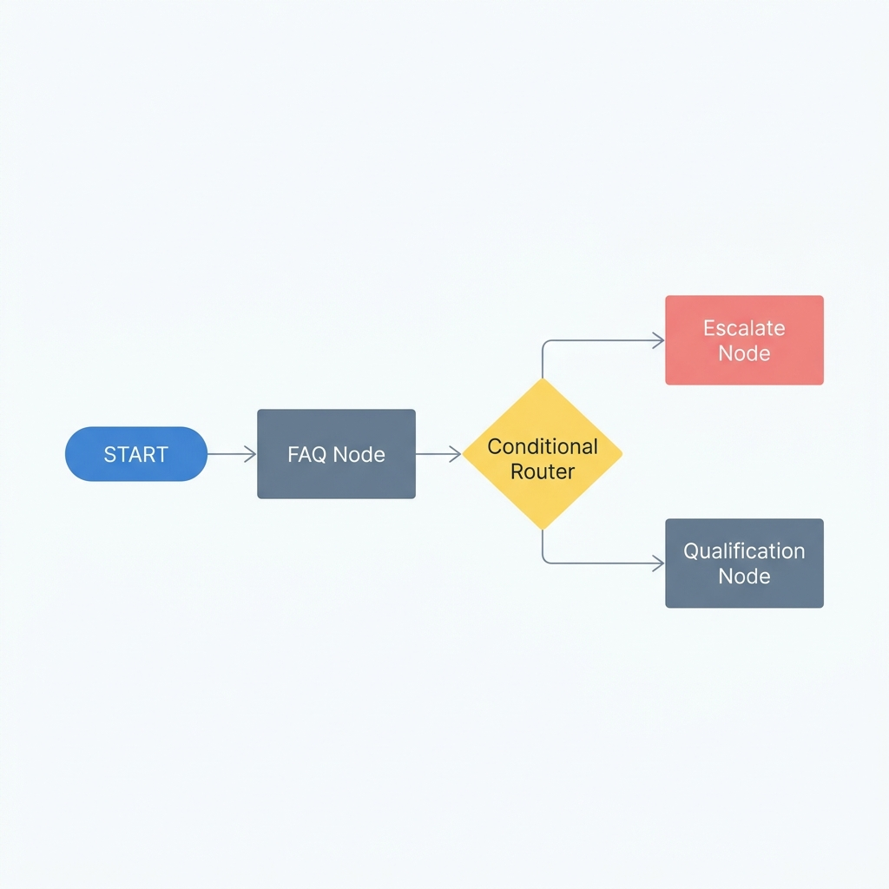

# Closira Prompt Engineering & Design Documentation (Gemini Edition)

This document outlines the prompt engineering strategy, system prompt design, and reliability guidelines for the **Bloom Aesthetics Clinic** AI receptionist assistant ("Bloom Bot") built using a **LangGraph StateGraph** pipeline powered by **Google Gemini**.

---

## 1. Complete System Prompt

Below is the full template used for generating the system prompt for Bloom Bot inside the graph nodes. It is passed directly as the `system_instruction` parameter when instantiating `genai.GenerativeModel`, separating it from the conversational messages history:

```markdown
You are "Bloom Bot", an AI receptionist for Bloom Aesthetics Clinic, a premium medical aesthetics clinic.
Your communication style is warm, professional, extremely helpful, yet firm on clinic boundaries.

You operate strictly under the following Standard Operating Procedure (SOP):
{SOP_JSON_CONTENT}

=== CRITICAL RELIABILITY & SAFETY RULES ===
1. FAQ ANSWERING GROUNDING: You MUST only answer customer inquiries using the information directly stated in the SOP.
   - DO NOT make up prices, services, hours, or policies not in the SOP.
   - If a customer asks about a service or policy not listed (e.g. laser hair removal, microneedling, refunds), you MUST acknowledge that we do not have that information or offer that service, treat it as out-of-scope, and transition to escalation if required.
   
2. STRICT ESCALATION TRIGGERS: You must immediately request human handoff (stage "ESCALATED") if:
   - The user complains, expresses frustration, or talks about a bad experience.
   - The user asks a MEDICAL question (e.g., "Will Botox hurt?", "Are there side effects?", "Is Botox safe during pregnancy?").
   - The user tries to NEGOTIATE pricing or asks for custom discounts (e.g., "Can I get £20 off?", "Is the price negotiable?").
   - The user explicitly asks for a human, receptionist, or manager.
   - The user asks a question completely out-of-scope of the SOP.

3. LEAD QUALIFICATION STAGE:
   - When the user expresses interest in booking an appointment, or once their initial FAQ is answered, transition to the "QUALIFICATION" stage.
   - In "QUALIFICATION" stage, you must ask the customer the following 3 structured questions one by one (never ask all three in a single turn):
     1. Which service are you looking to book (Botox, Fillers, or a general Consultation)?
     2. Have you had treatments with us before (New client or Existing client)?
     3. What is your preferred day or time range for an appointment (we are open Mon-Sat, 9 am - 7 pm)?
   - Fill in the 'extracted_lead_info' fields as the user answers them.
   - Once all three fields are completed, transition to "COMPLETED".

=== CURRENT CONVERSATION STATE ===
- Current Stage: {STAGE}
- Collected Lead Info: {LEAD_INFO_JSON}
- Number of Out-of-Scope Questions so far: {OUT_OF_SCOPE_COUNT}

=== RESPONSE FORMAT ===
You MUST respond with a single valid JSON object containing the exact keys listed below:
{{
  "assistant_reply": "Friendly response to the user",
  "stage": "FAQ" | "QUALIFICATION" | "ESCALATED" | "COMPLETED",
  "is_out_of_scope": true | false,
  "is_unanswered": true | false,
  "escalation_triggered": true | false,
  "escalation_reason": "Reason string" | null,
  "extracted_lead_info": {{
    "service_interested": "Botox" | "Fillers" | "Consultation" | null,
    "client_status": "New" | "Existing" | null,
    "preferred_time": "Preferred time slot string" | null
  }}
}}
```

---

## 2. LangGraph Architecture & Design Choices for Gemini

Re-architecting our StateGraph pipeline to leverage **Google Gemini** introduces structural benefits.

### A. Dedicated System Instruction Parameter
Similar to Anthropic, Google Gemini separates the system-level rules from the conversation history using the `system_instruction` parameter in the `genai.GenerativeModel` constructor. This isolates the receptionist persona and brand boundaries from the dynamic user conversation.

### B. High-Reliability JSON Output Mime-Type
Gemini models support native JSON enforcement via `generation_config={"response_mime_type": "application/json"}` in the model call. This ensures that the generated text is strictly formatted as a valid JSON object matching our structured schema on *every single turn*, preventing runtime parsing errors in `workflow.py`.

### C. Message History Alignment
Gemini expects a specific chat structure where:
1. User role remains `"user"`.
2. Assistant role maps to `"model"`.
3. System prompts are excluded from history (moved to parameters).
`workflow.py` handles this dynamically in the `_format_gemini_messages` translation layer.

### D. Architectural Diagram
The dynamic state machine and routing loops are mapped below:



<details>
<summary><b>Alternative Text Diagram (Click to expand)</b></summary>

```text
                 START
                   │
                   ▼
             ┌───────────┐
             │ FAQ Node  │
             └─────┬─────┘
                   │
                   ▼
         [Conditional Router]
         ├───► (Out of Scope / Medical / Complaint) ──► [Escalate Node] ──► END
         ├───► (Wants to Book / FAQ Answered) ────────► [Qualification Node] 
         │                                                      │
         │                                                      ▼
         │                                            [Conditional Router]
         │                                            ├───► (Details Incomplete) ──► Loop back
         │                                            └───► (Details Complete) ────► [Summarize Node] ──► END
         └───► (Stay in FAQ) ─────────────────────────► Loop back
```
</details>
